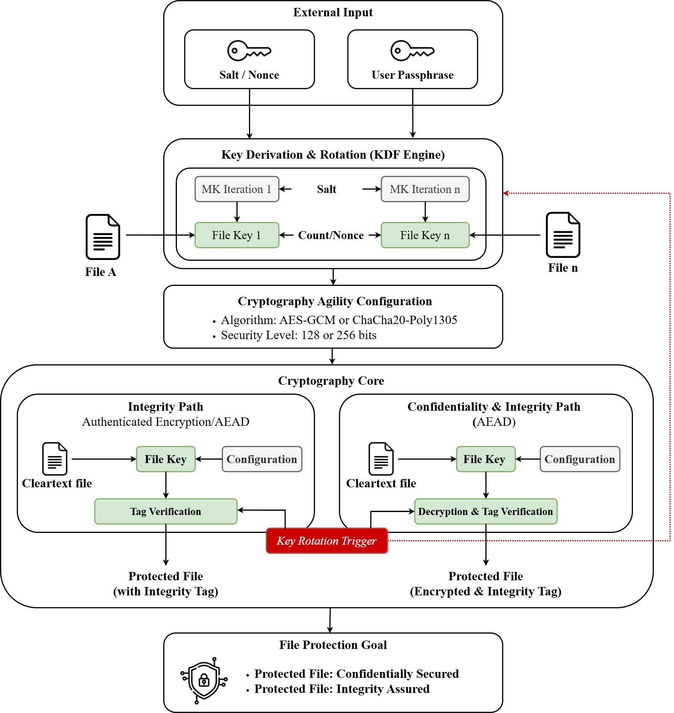

# Secure File Rotation & Protection System 🛡️

[](https://www.python.org/downloads/)
[](https://opensource.org/licenses/MIT)
[](#)

## 📌 Overview
This repository contains a professional-grade file protection utility developed for the **Master's in Cybersecurity at Harokopio University of Athens**. The system implements a "Defense in Depth" strategy to ensure data **Confidentiality** and **Integrity** for Data-at-Rest.

The core innovation lies in the **Dynamic Key Rotation** mechanism, which enforces a unique cryptographic key per file access, significantly reducing the blast radius of a potential key compromise.

## 🏗️ System Architecture
The following diagram illustrates the cryptographic flow, from Key Derivation (KDF) to the Authenticated Encryption (AEAD) process.



## ✨ Key Features
* **Cryptographic Agility:** User-selectable algorithms including **AES-GCM** and **ChaCha20-Poly1305**.
* **Automated Key Rotation:** Transparently rotates file keys after every successful decryption or integrity verification.
* **Hierarchical Key Management:** Secure key derivation from a Master Password using **Argon2id** (Memory-Hard KDF).
* **Configurable Security Levels:** Support for both **128-bit** and **256-bit** security parameters.
* **Tamper Detection:** Built-in integrity checks using **AEAD** tags to prevent bit-flipping and unauthorized modifications.

## 📂 Project Structure
```text
├── src/                # Core cryptographic engine and CLI implementation
├── docs/               
│   ├── diagrams/       # Architecture diagrams (PNG/JPG & Draw.io)
│   ├── media/          # Demo videos and Proof of Concept (PoC)
│   └── report/         # Final Technical Report (PDF)
├── requirements.txt    # Production dependencies (cryptography, argon2-cffi)
└── README.md           # Project documentation

## 🛠️ Quick Start

### 1. Prerequisites
* Python 3.9 or higher
* Recommended: Virtual Environment (venv)

### 2. Installation
Clone the repository and install the required cryptographic libraries:
```bash
git clone [https://github.com/drososkats/secure-file-rotation-python.git](https://github.com/drososkats/secure-file-rotation-python.git)
cd secure-file-rotation-python
pip install -r requirements.txt

### 3. Usage
```bash
python src/file_protector.py